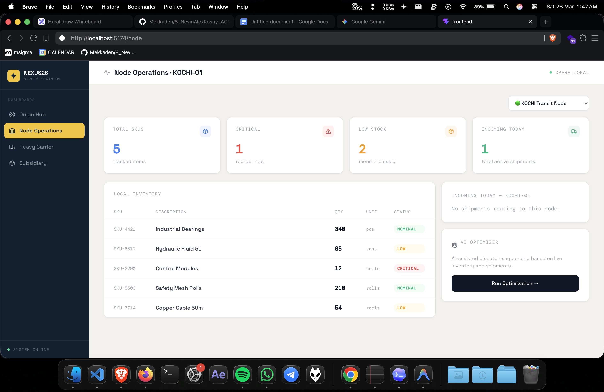

# Project Rules — ACM NEXUS 26

## 🚫 Git Rules (STRICT — READ THIS FIRST)

**NEVER perform any of the following without the user EXPLICITLY typing the instruction:**
- `git add`
- `git commit`
- `git push`
- `git merge`
- `git rebase`
- Any other git mutation command

**This applies even if:**
- The user says "save this" or "update the repo"
- A workflow step suggests it
- It seems like the natural next step after a code change

The user handles ALL git operations themselves. AI agents must only suggest the command text if asked — never auto-run it.
